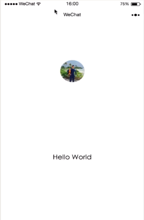
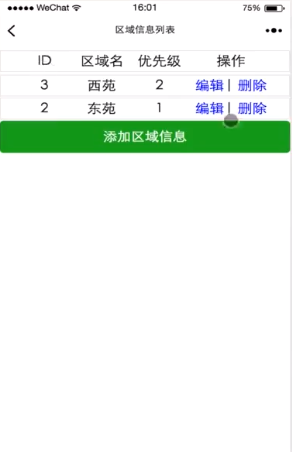
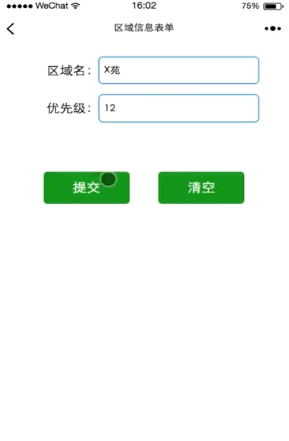

# 项目说明

- 本项目为慕课网，微信小程序开发入门练习
- springboot+mybatis
- 微信前端代码在wxFront-end文件夹下
- 删除操作按照restful规范本该使用DELETE请求，但不知什么原因DELETE请求传参有问题（传入后台参数为空，有兴趣的可以尝试修改一下），所以改成POST请求

- 慕课网微信小程序开发源码，大体写法和视频一样，部分地方以个人理解做了适当更改，尽可能的**使用springboot特性，简化代码**（如：除去datasource和sessionFactory类、mybatis.xml的构造，直接在SpringBoot中配置;修改controller访问地址和访问方式，尽可能符合**restful规范**）
 
- 参考资料：
 
&emsp;https://www.imooc.com/learn/945

- 开始使用

   ```
   1.创建数据库wx_program
   2.使用根目录下的area.sql导入表结构
   3.修改application.properties中数据库信息
   ```

   

# 项目截图







